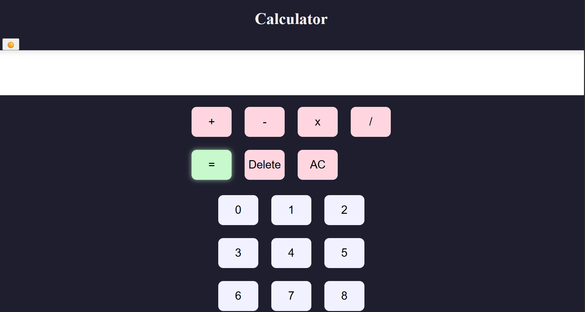
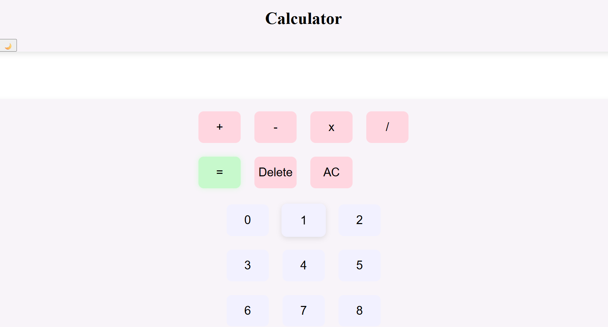

# 🎨 Basic Calculator

A simple, pastel-themed calculator built using **HTML, CSS, and JavaScript**.  
It performs basic arithmetic operations and features a soft aesthetic design.

---

## ✨ Features
- Addition, subtraction, multiplication, and division  
- Live screen display  
- Error handling using `try...catch`  
- Pastel UI with hover effects  
- Future plan: Dark mode toggle + keyboard input

---

## 🧠 What I Learned
- How to select HTML elements using `querySelector` & `querySelectorAll`
- How to loop through buttons and attach event listeners
- How to display user input dynamically
- Using `eval()` and `try...catch` for expression handling
- Styling layouts with Flexbox and Grid

---

## 🛠️ Tech Stack
- HTML5  
- CSS3  
- Vanilla JavaScript

---

## 🚀 How to Run
1. Clone this repository
2. Open `basic_calculator.html` in your browser
3. Enjoy the calculator!

---

## 📸 Screenshot

- Dark Mode

 
- Light Mode

